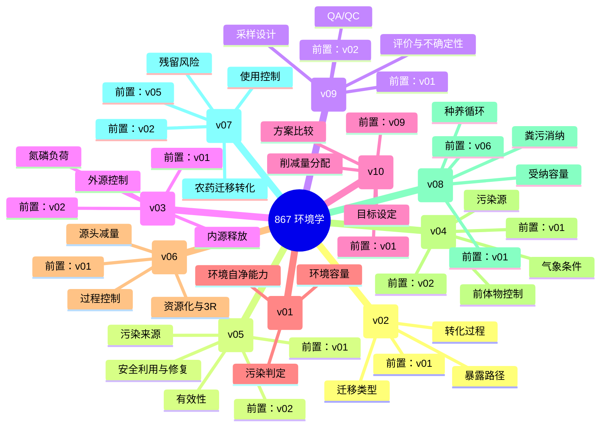

# 考试知识地图

## 学习顺序

1. **★★★★★ 污染物迁移与转化** — 核心必背（稳定）
2. **★★★★★ 土壤污染与修复** — 核心必背（稳定）
3. **★★★★★ 环境监测与质量控制** — 核心必背（稳定）
4. **★★★★★ 水体富营养化与负荷** — 核心必背（稳定）
5. **★★★★★ 环境规划与多方案决策** — 核心必背（稳定）
6. **★★★★★ 情境化环境容量与自净** — 核心必背（稳定）
7. **★★★★★ 清洁生产与物料流** — 核心必背（稳定）
8. **★★★★★ 大气污染事件诊断** — 核心必背（稳定）
9. **★★★★☆ 农业资源化与生态循环** — 高频重点（稳定）
10. **★★★★☆ 农药风险与农产品安全** — 高频重点（稳定）